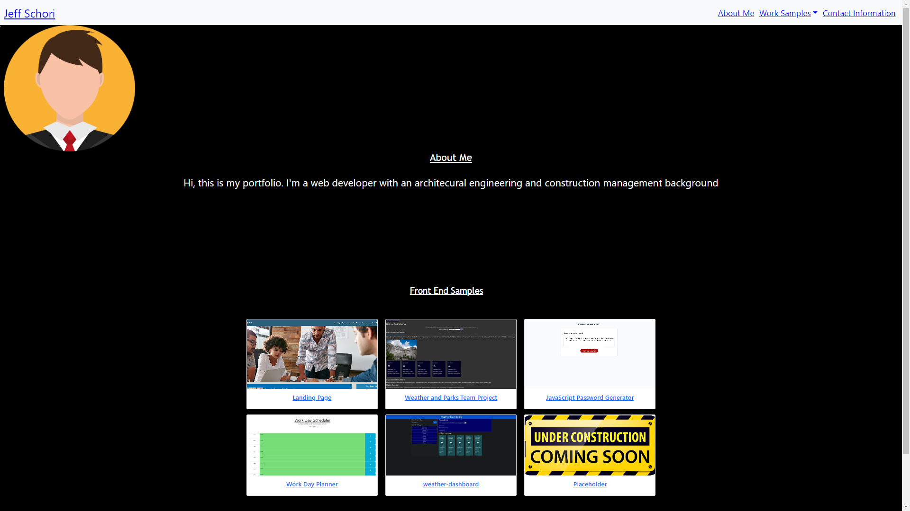

# Jeff Schori Portfolio without JavaScript

## Description

This project involves updating the CSS and HTML to create a basic portfolio

## Table of Contents 

* [Links](#links)

* [License](#license)

* [Screenshot](#screenshot)

* [Questions](#questions)

## Links
Jeff S first portfolio (https://schorij23.github.io/JeffS-Portfolio/#)

## Screenshot

## License

This project is licensed under the MIT license.

## Questions

If you have any questions about the repo, open an issue or contact me directly at schorij23@gmail.com. You can find more of my work at [schorij23](https://github.com/schorij23/).

